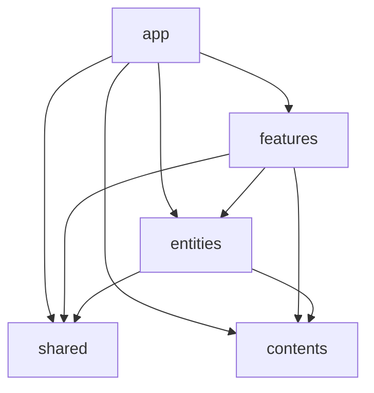

# コーディングガイド

## ディレクトリ依存関係

各ディレクトリの依存関係は以下のとおり（自己依存を除く）。これに違反するインポートは禁止。



- `shared/` はドメイン知識を持たない
- `entities/` はドメイン知識を持つ共通モジュール
- `features/` の各機能は互いに独立している
- `app/` にはメタデータ定義・レイアウト定義・SSG データ取得処理のみ置く

## コンポーネント規則

### ファイル構造

```
post-list/
├── post-list.tsx           # コンポーネント実装本体
├── post-list.css.ts        # スタイル実装（必要な場合）
├── post-list.test.tsx      # テスト
└── post-list.stories.tsx   # ストーリー
```

- ディレクトリ名・ファイル名は **kebab-case**
- **index.ts は使用しない**。直接ファイルパスでインポートする
  - 例: `import { PostList } from "./post-list/post-list"`
- テストは特に理由がない限り**スナップショットテスト**を含める
- ストーリーは存在するパターンを網羅する

### デザインシステムの活用

- アイコンは `design-system/icons` に定義してそれを使う
- レイアウト・テキスト・リンクなどの汎用 UI は `design-system` を利用する
- 色・幅などの値は**デザイントークン**を使い、ハードコードしない

```tsx
// Good
import { theme } from "@/shared/design-system/theme.css";
style({ backgroundColor: theme.color.background.primary })

// Bad
style({ backgroundColor: "#ffffff" })
```
