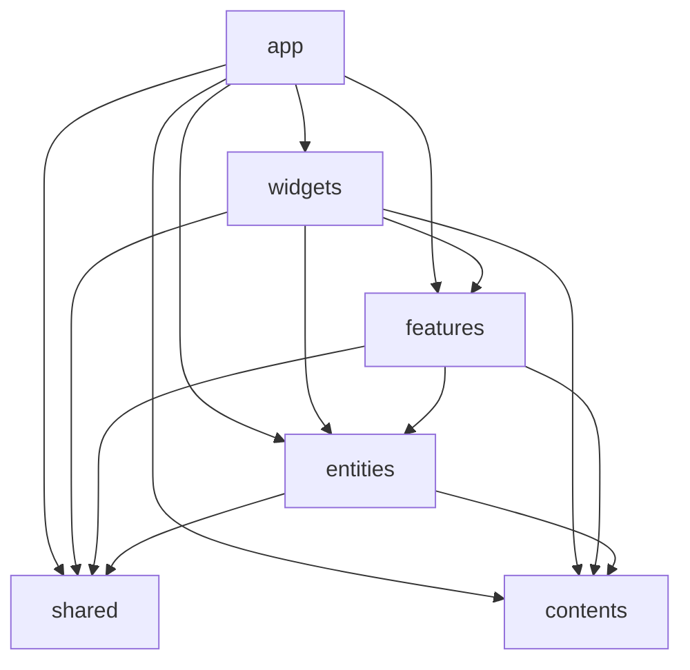

# プロジェクト構造

Feature-Sliced Design（FSD）をベースにした構造。
公式: https://feature-sliced.design/

公式 FSD を土台にしつつ、一部独自の判断を加えている。該当箇所には注釈あり。

## レイヤー

上から下へのみ依存できる（逆は禁止）。



| レイヤー | 役割 |
|----------|------|
| `app/` | エントリポイント（Next.js App Router）、グローバル設定、プロバイダー |
| `widgets/` | まとまりのある UI ブロック（記事一覧、詳細画面、ヘッダーなど） |
| `features/` | 複数の widgets で横断的に再利用される小さな機能パーツ（共通ボタン、共有フォームなど） |
| `entities/` | ビジネスエンティティ、複数機能で共有する型・ルール |
| `shared/` | ドメインに依存しないユーティリティ、UI キット |
| `contents/` | 外部データとの吸収層、DTO、変換（※ 公式 FSD の `shared/api` に相当するが独立レイヤーとして分離） |

### widgets と features の違い

- `widgets` — まとまりのある UI ブロック。ページの一区画を構成する単位（記事一覧、詳細画面、ヘッダー、サイドバーなど）
- `features` — 横断的に再利用される小さな機能パーツ。複数の widgets から共通で使われるもの（共通ボタン、共有フォームなど）

例: 記事一覧（widget）や詳細画面（widget）の中で、共通の「いいねボタン」（feature）を使う。

## スライス内の構造

各スライス（例: `features/login/`）は以下のセグメントを持てる。

| セグメント | 内容 |
|-----------|------|
| `ui/` | コンポーネントと関連フックを機能単位でパッケージング |
| `models/` | 共通の型定義、ヘルパー |
| `helpers/` | その他共通のユーティリティ |

`ui/` 内は機能単位でディレクトリを切り、関連するコンポーネントとフックを一緒に置く（コロケーション）。

```
features/login/
  ui/
    login-button/
      login-button.tsx
      use-login.ts
    confirm-dialog/
      confirm-dialog.tsx
      use-confirm-dialog.ts
  models/
  helpers/
  index.ts          ← Public API
```

## ルール

### [Must] 上位レイヤーは下位にのみ依存

依存の方向を統一し、変更の影響範囲を予測しやすくする。

### [Must] 各スライスは Public API (`index.ts`) を通じて公開

スライスの外部からは `index.ts` 経由でのみアクセスする。内部のファイル構造を直接参照しない。
`index.ts` を維持すれば内部リファクタリングが呼び出し側に影響しない。

### [Must] ディレクトリ名・ファイル名は kebab-case

### [Should] `index.ts` にコンポーネント本体を書かない

`index.ts` は re-export 専用。コンポーネント本体は別ファイルに書く。
エディタのタブや検索結果で `index.ts` だらけになるのを防ぐ。

### [Must] `shared` にビジネスロジックを入れない

- `shared/` — ドメインに依存しないユーティリティのみ（日付操作、汎用 HTTP クライアントなど）
- `contents/` — 外部との吸収層、DTO、変換（ビジネス知識を含む）

### [Should] `entities` は最初から分けすぎない

- 最初は widgets にまとめる
- 複数の widgets で横断して使うパーツが出てきたら entities に切り出す

entities に置くのは、複数箇所から参照される型・ルール・シンプルな表示コンポーネントに留める。
