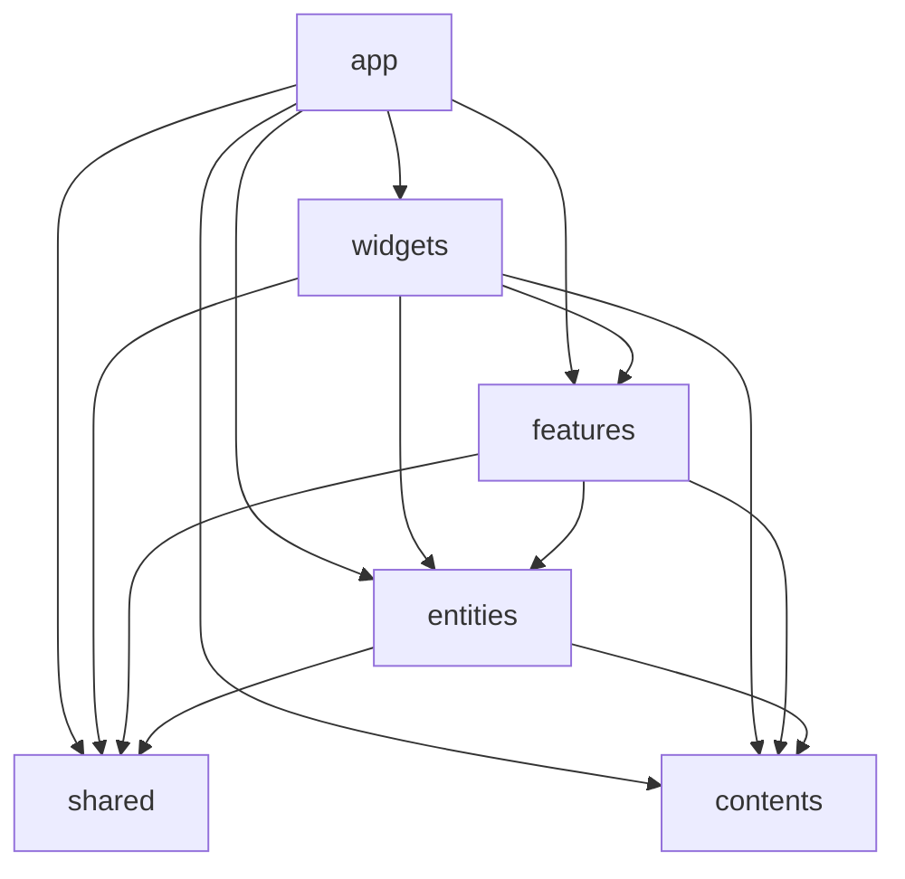

# Project structure

Feature-Sliced Design (FSD) with a few repo-specific choices. Official reference: https://feature-sliced.design/

## Layers

Dependencies flow **downward only** (never upward).



| Layer | Role |
|-------|------|
| `app/` | Entry (Next.js App Router), global config, providers |
| `widgets/` | UI blocks on screen (concrete slice names, e.g. `creation-list`) |
| `features/` | Cross-widget reusable capabilities and UI pieces |
| `entities/` | Shared models (types, rules, paths, readers). **No UI** |
| `shared/` | Domain-agnostic utilities and UI kit |
| `contents/` | External data boundary, DTOs, transforms (like official `shared/api`, but a separate layer) |

### widgets vs features

- `widgets` — Visible blocks; slice names are concrete (`creation-list`), not domain parent folders
- `features` — Cross-widget shared behavior under `features/<domain>/<feature-name>/` (below)

Example: `widgets/writing-list` uses `features/creation/creation-card`.

## features slice layout

`features/<domain>/` is **organizational only** (no `index.ts`). Public API lives in `<feature-name>/index.ts`.

```
features/creation/              # grouping only (no index.ts)
  creation-card/
    ui/creation-card/
      creation-card.tsx
    index.ts
```

- **import** — `from ".../features/creation/creation-card"` (feature package directly)
- Cross-cutting infra (e.g. MDX) may live under `features/mdx/` with root `index.ts` / `index.client.ts` barrels

## Inside a slice (widgets / feature package)

| Segment | Purpose |
|---------|---------|
| `ui/` | Components and related hooks, packaged by feature |
| `models/` | Shared types and helpers |
| `helpers/` | Other shared utilities |

Colocate related components and hooks under `ui/<feature-name>/`.

```
widgets/creation-list/
  ui/
    creation-list/
      creation-list.tsx
  index.ts          ← Public API

features/creation/creation-card/
  ui/
    creation-card/
      creation-card.tsx
  index.ts          ← Public API (no index.ts directly under creation/)
```

## Rules

### [Must] Upper layers depend on lower layers only

Keeps change impact predictable.

### [Must] Expose slices via Public API

External code imports only through the Public API, not internal paths.

Usually a single `index.ts`. For Next.js App Router (RSC), split entries when **server-only** and **client-only** exports must not mix.

| File | Purpose | Leading directive |
|------|---------|-------------------|
| `index.ts` | Usable from both client and server (types, isomorphic helpers) | none |
| `index.server.ts` | Server Components, readers in `models`, etc. | none |
| `index.client.ts` | Client-only hooks | `"use client"` required |

**Import rules (callers)**

- Server → server-only API: `from ".../slice/index.server"`
- Client → client-only API: `from ".../slice/index.client"`
- Either → shared API: `from ".../slice"` (`index.ts`)

**When to split**

- `useEffect`, browser APIs, React hooks → `index.client.ts`
- Build/request-only serializers → `index.server.ts`
- Mixing these in `index.ts` can pull client boundaries into server imports

**Example (MDX)**

```
entities/mdx-content/
  index.server.ts    # serializeMDXContent, markupMermaid

features/mdx/
  content-resolver/
  mermaid/           # useMermaid (index.client.ts)
  twitter/
  index.ts
  index.client.ts
```

```ts
// Server (reader)
import { serializeMDXContent } from "../../../entities/mdx-content/index.server";

// Client (UI)
import { useMermaid } from "../../../features/mdx/index.client";
import { resolveMDXContent } from "../../../features/mdx";
```

Add `index.client.ts` / `index.server.ts` only where needed—not on every slice.

### [Must] kebab-case for directories and files

### [Should] Do not put component bodies in `index.ts`

`index.ts` is re-export only.

### [Must] No business logic in `shared`

- `shared/` — domain-agnostic utilities only
- `contents/` — external boundaries, DTOs, transforms (may include business knowledge)

### [Should] readers in entities; cross-cutting UI in features

- **entities** — types, rules, paths, `readXxx` (`index.server.ts`)
- **features** — reusable UI and plugins (not entity UI)
- **widgets** — screen blocks; avoid abstract domain slices like `widgets/creation/`
