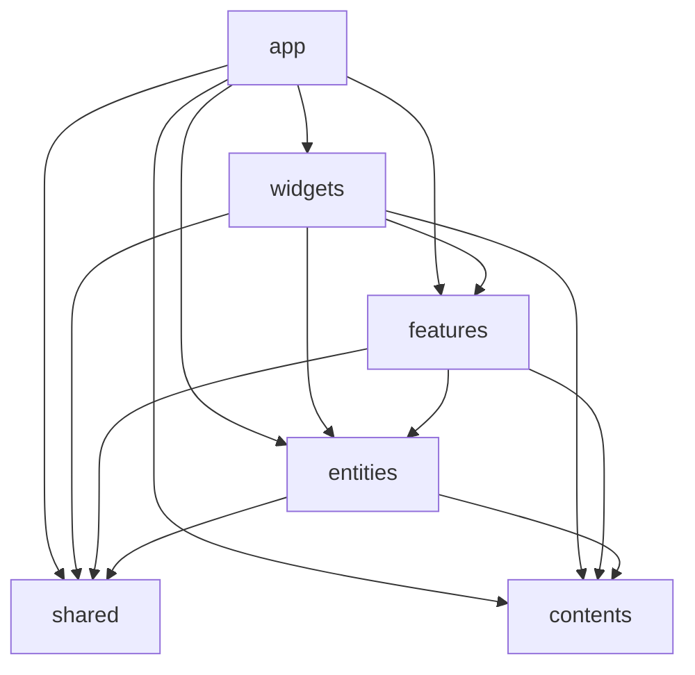

# プロジェクト構造

Feature-Sliced Design（FSD）をベースにした構造。
公式: https://feature-sliced.design/

公式 FSD を土台にしつつ、一部独自の判断を加えている。該当箇所には注釈あり。

## レイヤー

上から下へのみ依存できる（逆は禁止）。



| レイヤー | 役割 |
|----------|------|
| `app/` | エントリポイント（Next.js App Router）、グローバル設定、プロバイダー |
| `widgets/` | 画面上にブロックとして表示する UI 単位（スライス名は具象名: `creation-list` など） |
| `features/` | 複数 widgets で横断的に再利用される共通機能・UI 部品 |
| `entities/` | 複数機能で共有するモデル（型・ルール・パス・reader）。**UI なし** |
| `shared/` | ドメインに依存しないユーティリティ、UI キット |
| `contents/` | 外部データとの吸収層、DTO、変換（※ 公式 FSD の `shared/api` に相当するが独立レイヤーとして分離） |

### widgets と features の違い

- `widgets` — 画面に見えるブロック。スライス名は `creation-list` のように具象名で、ドメイン名の親フォルダは置かない
- `features` — widgets 横断の共通機能。`features/<domain>/<feature-name>/` に配置する（後述）

例: 記事一覧（`widgets/writing-list`）で `features/creation/creation-card` のカード UI を使う。

## features のスライス構造

`features/<domain>/` は **整理用ディレクトリのみ**（`index.ts` なし）。Public API は `<feature-name>/index.ts` に置く。

```
features/creation/              # 束ねるだけ（index.ts なし）
  creation-card/                # 機能パッケージ
    ui/creation-card/
      creation-card.tsx
    index.ts
```

- **import** — `from ".../features/creation/creation-card"` のように機能パッケージを直指定する
- 横断基盤（MDX など）は `features/mdx/` 配下にサブ feature を切り、ルート `index.ts` / `index.client.ts` で barrel してよい

## スライス内の構造（widgets / feature パッケージ）

各スライス（例: `widgets/creation-list/` や `features/creation/creation-card/`）は以下のセグメントを持てる。

| セグメント | 内容 |
|-----------|------|
| `ui/` | コンポーネントと関連フックを機能単位でパッケージング |
| `models/` | 共通の型定義、ヘルパー |
| `helpers/` | その他共通のユーティリティ |

`ui/` 内は機能単位でディレクトリを切り、関連するコンポーネントとフックを一緒に置く（コロケーション）。

```
widgets/creation-list/
  ui/
    creation-list/
      creation-list.tsx
  index.ts          ← Public API

features/creation/creation-card/
  ui/
    creation-card/
      creation-card.tsx
  index.ts          ← Public API（creation/ 直下には index.ts なし）
```

## ルール

### [Must] 上位レイヤーは下位にのみ依存

依存の方向を統一し、変更の影響範囲を予測しやすくする。

### [Must] 各スライスは Public API を通じて公開

スライスの外部からは Public API 経由でのみアクセスする。内部のファイル構造を直接参照しない。
Public API を維持すれば内部リファクタリングが呼び出し側に影響しない。

基本は `index.ts` 1 本。Next.js App Router（RSC）で **Server 専用** と **Client 専用** の export が混在するとビルドエラーになるため、必要なスライスだけエントリを分ける。

| ファイル | 用途 | 先頭ディレクティブ |
|----------|------|-------------------|
| `index.ts` | Client / Server 両方から import できるもの（型、両環境で動く関数） | なし |
| `index.server.ts` | Server Component・`models` の reader など Server 専用 | なし |
| `index.client.ts` | Client Component 専用の hook など | `"use client"` 必須 |

**import の使い分け（呼び出し側）**

- Server から Server 専用 API → `from ".../slice/index.server"`
- Client から Client 専用 API → `from ".../slice/index.client"`
- どちらからも使う API → `from ".../slice"`（`index.ts`）

**分け方の目安**

- `useEffect` / ブラウザ API / React hook を export する → `index.client.ts`
- ビルド時・リクエスト時にだけ動く serializer など → `index.server.ts`
- 上記を `index.ts` にまとめると、Server 側の `import` だけで Client 境界が伝播しうるので分離する

**例（MDX）**

```
entities/mdx-content/
  index.server.ts    # serializeMDXContent, markupMermaid

features/mdx/
  content-resolver/  # resolveMDXContent
  mermaid/           # useMermaid（index.client.ts）
  twitter/           # useTwitter（index.client.ts）
  index.ts           # resolve 等の barrel
  index.client.ts
```

```ts
// Server（reader）
import { serializeMDXContent } from "../../../entities/mdx-content/index.server";

// Client（UI）
import { useMermaid } from "../../../features/mdx/index.client";
import { resolveMDXContent } from "../../../features/mdx";
```

`index.client.ts` / `index.server.ts` は **必要なスライスにだけ** 追加する。全スライスに必須ではない。

### [Must] ディレクトリ名・ファイル名は kebab-case

### [Should] `index.ts` にコンポーネント本体を書かない

`index.ts` は re-export 専用。コンポーネント本体は別ファイルに書く。
エディタのタブや検索結果で `index.ts` だらけになるのを防ぐ。

### [Must] `shared` にビジネスロジックを入れない

- `shared/` — ドメインに依存しないユーティリティのみ（日付操作、汎用 HTTP クライアントなど）
- `contents/` — 外部との吸収層、DTO、変換（ビジネス知識を含む）

### [Should] reader は entities、横断 UI は features

- **entities** — 型・ルール・パス・`readXxx` などのデータ取得（`index.server.ts`）
- **features** — 複数 widgets で使う UI 部品や MDX プラグインなど（entity の UI は置かない）
- **widgets** — 画面ブロック本体。ドメイン名の抽象スライス（`widgets/creation/`）は避け、具象スライス名を使う
