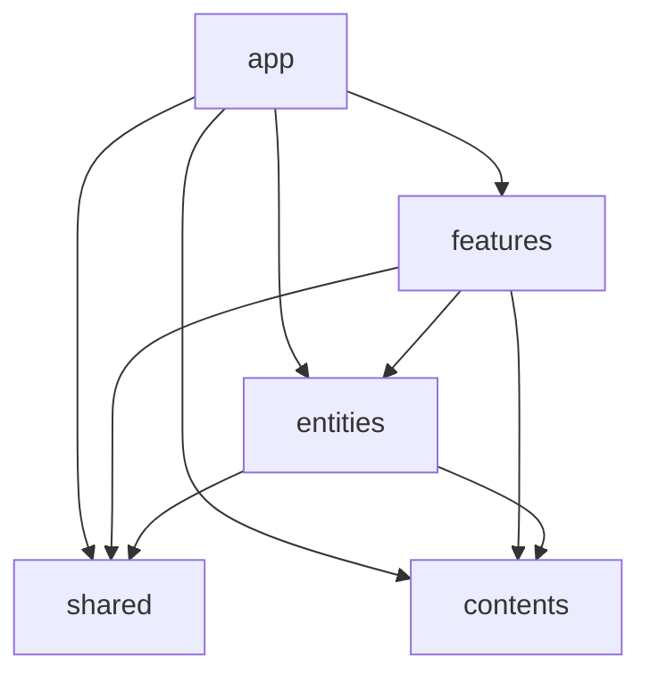

# ディレクトリ構造

このドキュメントでは、syakoo-lab プロジェクトのディレクトリ構造について説明する

## 基本構造

ディレクトリ構造の概要は以下の通りである
機能や共通物などの提供するものの分類をし、コンポーネントやフックなどの解決する手段としての分類はしない

```
src/
├── app/           # Next.js App Router のページコンポーネント
├── contents/      # コンテンツデータ
├── entities/      # ドメインに関連する共通モジュール
├── features/      # 機能単位のコンポーネントや処理
└── shared/        # ドメインに関連しない共通モジュール
```

- [MUST] components, hooks などの提供する種類で分類するディレクトリは持たない

## 各ディレクトリの役割

### app/

Next.js の App Router で使用するページコンポーネントのディレクトリ

- [MUST] 以下のみが実装されている：
  - メタデータ定義
  - ページ特有のレイアウト定義
  - SSG に必要な初期データ取得処理の実行

### contents/

サイトのコンテンツデータのディレクトリ

- [MUST] サイトに使用する、自己紹介情報や記事情報のみを持つ

### entities/

ドメイン知識を持つ、共通して使用するモジュールのディレクトリ

- [MUST] ドメインを含む共通コンポーネント、関数、モデルの定義を持つ
- [SHOULD] ドメインを含まない場合は、shared に置く

### features/

機能を実現するためのモジュールのディレクトリ

- [MUST] フック、コンポーネントなどを用いて機能として提供する
- [MUST] 各機能は独立している

### shared/

ドメイン知識を持たない、共通して使用するモジュールのディレクトリ

- [MUST] ドメイン知識を持たない

## ディレクトリの依存関係

各ディレクトリの依存関係は以下の図のとおりである。(自己依存を除く)

- [MUST] 全ての依存関係は以下に該当する


