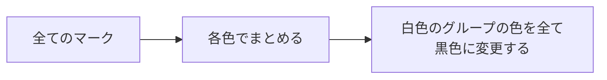
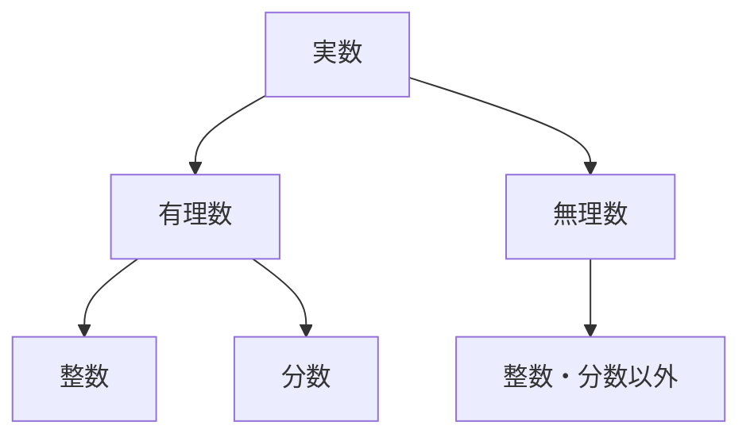

数学やソフトウェア開発をしていたら、たびたび定義や定理、関数やモジュールを作成したりまとめたり使用したりすると思います。
これらの**抽象化**は、具体化されて存在する問題や事象をある特徴によってまとめることにより一見異なるものを同じ概念として扱い解決することができる一方で、
そのまとめ方は人や目的によって異なるためそれこそ抽象化されすぎたようなフワッとしたものになってしまうことがよくあります。

本記事では、抽象化とはどういうものか、また抽象化の難しい点について説明していきます。

## 抽象化とは

そもそも **抽象化(Abstraction)** は、「ある対象から重要ではない部分を取り除くことによって単純化すること」を指します。
この言葉自体が抽象化されていて掴みづらいので、個人的にイメージしやすい「グループ化」「線引き」について説明していきます。

### グループ化

■
▲
■
★
★
▲

あなたは上の色付きのマークを管理しています。
ある日、上司から次のタスクを依頼されました：

上司「白色のマークあるでしょ、それを今回だけ黒色に変更してほしい」

さて、あなたはどのようにしてこのタスクを解決しますか？
全てのマークを一つ一つ確認して、それが白色であれば色を変更する人もいるかと思いますが、次のように解決したとします：

このとき、様々な色のあるマークから各色で"**グループ化**"する動作を最初にしています。これが抽象化にあたります。
今回の色変更のタスクにおいて、**あくまで必要な情報はそれが何色かということであり、マークが何かである情報は必要ない**ため消しているのです。

また、上司の言葉をもう一度思い返すと「今回だけ」と言っているためまた白色に戻す可能性があります。
そこで、各色でまとめた抽象化された色情報を管理することで、次はすぐに戻すことができるようになります。

### 線引き

あなたは友達からこんな質問をされました：

友達「ねえねえ、これって何色？ → 」
友達「じゃーこれは？ → 」
友達「これは？ → 」

もしかしたらあなたは「黒」「白」「グレー」と答えたかもしれません。
これらの判断も抽象化によるものです。
なぜならあなたは以下のカラーコード `#000000` から `#ffffff` のグラデーションの中からある基準により「黒」「グレー」「白」などと線引きをしてまとめたためです。

 

 

このように、抽象化という動作はみんなが常日頃から行っています。

### 抽象化により木のような構造になる

さて、抽象化という作業がどういうものかについてイメージが付いたところで、この抽象化によって対象がどのようになるのかについて説明していきます。
ここでは、「実数」における抽象化を例に考えていきます。

まず、具体化されている「数」である「実数にある一つ一つの数」を思い浮かべてみてください。
そうすると、実数の一つ一つの数は 8 などの「有理数」と $\pi$ などの「無理数」と分けることができます。
また、有理数を一つ一つ見ていくと「整数」と「分数」に分けることができます。

ここでこれらの抽象化を図としてまとめてみると次のようになります：

少しイメージが難しいかもしれませんが、この図の下に実数の一つ一つの数が並べられていることを想像してみてください。
具体である「実数の一つ一つの数」は「整数」「分数」と「それ以外」に抽象化され、それらはまた「有理数」と「無理数」に抽象化されていることになります。
このように一般的に具体（実数の一つ一つの数）と抽象（実数や有理数など）は $N:1$ の関係になり、数学のグラフ理論でいう「木」のような構造を成します。

これにより、抽象化することで複数の具体を同時に扱うことができ、多くのものをより簡単に解決することが可能になるのです。

## 抽象化の落とし穴

さて、これまで抽象化の良さを中心に話してきました。
$N$ 個のものを $1$ で解決することができるのに現実ではそう簡単にはいきません。
なぜなら抽象化という工程はそれをする**人や目的によって結果が変わってしまう**ためです。

### 人や目的によって抽象化の結果が変わる

上で「グループ化」と「線引き」について説明しましたが、抽象化の例を聞いて

🤔「自分だったらこうまとめるな...」

と思った人がいたらまさにそれが抽象化が難しい大きな原因です。
抽象化は $N:1$ として木構造にまとめることができる一方で、その木の形は**人や目的によって変わってしまいます**。
言い換えると、「抽象」→「具体」は具体:抽象 $= N:1$ ですが、「具体」→「抽象」（いわゆる抽象化）も具体:抽象 $= 1:M$ と言われています。

例えば「グループ化」での例について、私は「全てのマークを"各色でまとめる"」という抽象化をしましたが同じ目的でも人によっては「白色かどうかでまとめる」とすると思います。
また、上司からの依頼が「色の変更」だったため色で抽象化しましたが、「形の変更」であればむしろ色の情報が不要になってしまいます。

このように、人や目的によって抽象化の形が非常に大きくずれることから抽象化は難しく、それがソフトウェア開発では「設計は一人がした方が良い」と言われる理由の一つにもなります。

### 人や目的によって欲しい抽象度が変わる

一般的に問題の解決は「具体（問題）」→「抽象（原因、解決策）」→「具体（結果）」と具体と抽象を行ったり来たりしており、解決の途中で作業を他の人に任せることが多くあります。
例えばあなたは上司から次のような依頼を受けました：

上司「このタスクなんだけど、これをこうする感じに変更して期限はこれくらいでやってください」

あなたはどう思うでしょうか？ありがたいですか？面白くないと感じますか？
もちろん場面によりますが、この依頼がうれしいと思った方は具体化された段階でバトンを受け取りたいタイプであり、面白くないと思った方は抽象化された状態で受け取りたいタイプになります。

問題の解決において抽象の段階に入った問題は、どういう着地点に持っていくかという具体化の段階に入ります。
このとき、どのくらい具体化された状態でタスクを受け取りたいかは人によって異なります。
なぜなら、**抽象化されすぎている状態だと着地点が多く自分で決めないといけないことが多く**、逆に**具体化されすぎていると着地点が少なすぎて自由度が少なくなってしまう**ためです。
例えば、あなたがタクシー運転手で客から「この交差点を右に曲がって、次の交差点を...」と言われるか「XX 駅に、なるはやで。」と言われるかで自由度がまったく異なることがわかります。

また、最近よく耳にする ChatGPT なども具体と抽象の観点で考えると、以前のチャットボットより抽象度を上げて依頼を投げても良い落としどころを見つけてくれるようになったという捉え方ができるかと思います。

## まとめ

抽象化について、どういうものか、またなぜ難しいのかについて説明していきました。
また、参考文献にある『「具体 ⇆ 抽象」トレーニング』を読むとより詳しくそれぞれの特徴や扱い方を知ることができます。

抽象化とは？

- 対象からグループ化や線引きなどをしていらない属性を消し単純化したもの

何がうれしいの？

- 対象をまとめて解決することができる

なぜ難しいの？

- 人や目的によって抽象化した結果が異なる
- 人や目的によって欲しい抽象度が異なる

## 参考文献

- 細谷 功,「具体 ⇆ 抽象」トレーニング 思考力が飛躍的にアップする 29 問, 2023/02/09
