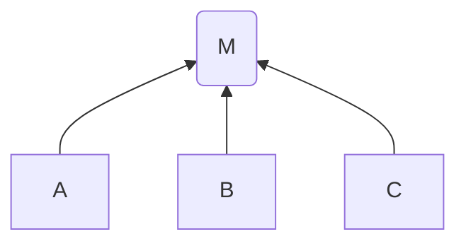

この記事で主張する結論を以下に挙げます：

- モジュールを実装するということは一部システムを抽象化するということである
- モジュールとして抽象化するとそこに依存関係が生まれる

## モジュールの作成は一部システムの抽象化である

<Image
  src={"/img/writings/20230527/module.png"}
  caption="モジュールの構造"
  style={{ width: 400 }}
/>

Modular Design において、システムは**モジュール** (module) という単位で分割されそれらのモジュールは**依存関係**によって繋がっています。
そして、このモジュールはそれを行うことによって得られる恩恵である **機能 (Functionality)**、その機能における命名、必要な引数や返り値の型情報、コメントなどによるドキュメントである **インターフェース (Interface)** という構造に成っています。

あるシステムにおいてモジュールを作成するということは、一部の具体的な仕様・機能をシステムから取り除きインターフェースのみを残すということであり、
これはその**一部システムを抽象化**したと言うことができます。

## モジュールとして抽象化するとそこに依存関係が生まれる

さて、モジュールを実装することが抽象化になることが分かったところで、それらの依存関係に注目してみます。

当然モジュールの作成により依存関係を構築するため、システムの一部処理をモジュールとして抽象化することによりそのシステムとモジュールには依存関係が生じるようになります。

依存関係が生じることによりモジュールとしての抽象化には注意が必要な点があります。
それは必要以上にモジュールが依存関係を持つ過度な抽象化です。
例として次の 3 つの処理 $A,B,C$ をするシステムがあったとして、あなたはそれらの処理に共通する処理をモジュール $M$ として抽象化するとします。
すると、以下のように処理 $A,B,C$ はモジュール $M$ に依存するような関係を成します：

これにより、各処理でモジュール化された一部機能を実装する必要がなくなり $A,B,C$ 全てに対して変更をしたい場合に簡単に済む一方で、
$B$ だけ変更したい場合には $A, C$ に予期しない変更が入る可能性があるため注意が必要になります。

このように、処理が共通だからと DRY 原則を気にしすぎるがあまりに複数の機能を一つに抽象化してしまうと依存関係が過度に増え、かえってコードが複雑になってしまいます。
そのため、Sandi Metz 著の [The Wrong Abstraction](https://sandimetz.com/blog/2016/1/20/the-wrong-abstraction) にて「prefer duplication over the wrong abstraction」と主張しているように、
過度に抽象化するのであれば重複していたほうがマシであると私は考えています。

## まとめ

本記事では、モジュールを実装するということが抽象化することであるということ、またモジュールとして抽象化することによりそこに依存関係が生じることについて説明しました。

なお、モジュールのようにこの記事も今後のさまざまな記事で使用することを目的としています。

## 参考文献

- John Ousterhout, A Philosophy of Software Design, 2022
- Sandi Metz, The Wrong Abstraction, 2016, https://sandimetz.com/blog/2016/1/20/the-wrong-abstraction
