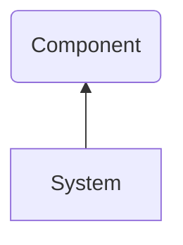
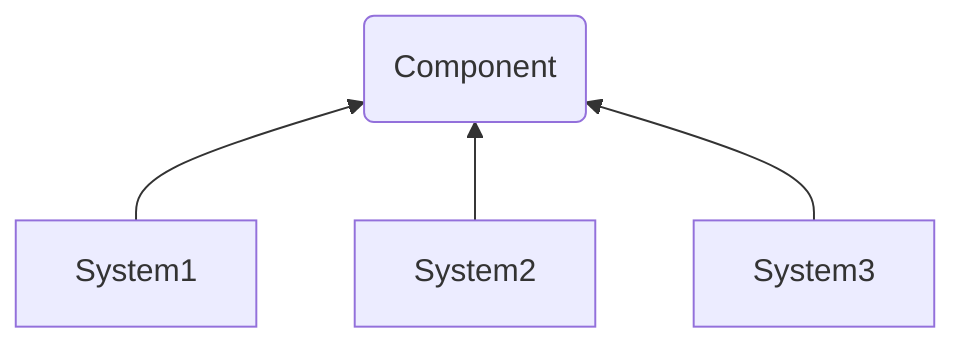

この記事では Web アプリにおけるコンポーネント化がどのような抽象化を行っているのかについて説明していきます。
別の記事でモジュール化と抽象化について説明しました。
コンポーネントはモジュールを具体化したものの一つであり本記事でもそちらの記事の内容を含みますので、気になったら読んでいただければと思います。

https://syakoo-lab.com/writings/20230527

なお、ここではコンポーネントを React のコンポーネントとして考えています。
一般的なコンポーネント、別のライブラリなどのコンポーネントとは異なる説明がある場合がありますのでご了承ください。

## コンポーネント化によるシステムの変化

皆さんの中には何気なくコンポーネント化している方もいるかと思いますが、コンポーネント化することによってシステムにどう影響するのか見ていきましょう。

システムからある機能をコンポーネント化するとその機能の詳細はシステムから分離され、インターフェースを使って機能の恩恵を得ることができるようになります。
これがいわゆる**機能の抽象化**であり、機能とインターフェースの構造がどうなっているのかについては次章で説明します。
この抽象化により、大元のシステムとコンポーネントには**依存関係**が生じ、コンポーネントが変更されるとシステムに影響するようになります。

複数のシステムから同じ機能をコンポーネント化する場合も同様であり、それらの機能は同じインターフェースを使って恩恵を得ることができるように抽象化され、
そこには依存関係が発生することになります。

## コンポーネントの構造

コンポーネントとして抽象した結果、コンポーネント内部ではどのような構造になっているのか見ていきましょう。

### コンポーネントにおける機能とインターフェース

<Image
  src={"/img/writings/20230530/component.png"}
  caption="コンポーネントの構造"
  style={{ width: 400 }}
/>

あるシステムから一部機能をコンポーネントとして抽象化するとき、その構造はモジュールと同様に機能 (Functionality) とインターフェース (Interface) に分けることができます。
機能はそもそも抽象化せずに実装したときのようなシステムとして得られる恩恵 (ビュー、スタイリング、ロジック) であり、インターフェースは抽象化した結果そのコンポーネントを使うために必要な情報として残されたものであり具体的に次のものが挙げられます：

- Props (引数) の命名や型
- 返り値 (基本的に JSX Element)
- コンポーネント名
- ドキュメント
- Test
- Storybook

### 抽象化されたコンポーネントの具体化

さて、インターフェースとして命名や型、ドキュメント、Test、Storybook を挙げましたがその役割を見ていきます。
それらはどれも直接コンポーネントに影響するものではありませんが、抽象化されたコンポーネントを具体化するのに役に立ちます。
適切に具体化することでそのコンポーネントの目的や役割を鮮明にし、想定しない使用方法や変更を避けることができるようになります。

## コンポーネントとして共通化する注意点

コンポーネントとして抽象化することによりモジュールの場合と同様にコードを分割することができ、色々なケースで用いることが可能になります。
その一方で、コンポーネントはその機能としてロジックだけではなくスタイリングやビューの構造などの責務も担うことになるため、複数のケースで用いて良いのかといった判断をより慎重に行う必要があります。
特に、スタイリングはエンジニアではなくデザイナーが決定している場合が多いと思うため、パッと見同じ見た目でもそれらを同一視してるかについて確認を取るべきだと私は考えています。

## まとめ

本記事では、Web アプリにおけるコンポーネント化が抽象化としてどのような構造を成すのかについて確認し、モジュールよりも慎重に共通化しなければならないことについて説明しました。
