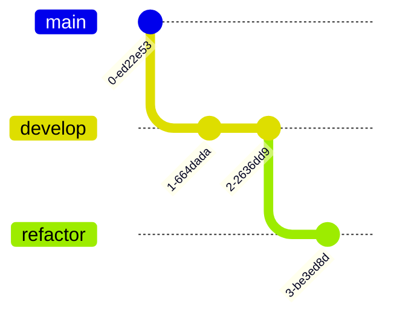

少し前に社内で PR にリファクタリングを混ぜるか・混ぜないかについて秒で終わったが話題には上がった。

これは難しい問題の一つだと個人的には考えており、極論を言えば「時と場合とプロジェクトによる」と締めくくられるヤツだが、
抽象化された議論に対して線引きを放棄するのは私的には嫌なので自分の観測内で線引きをしてみる。

## まとめ

- 理想としては実装とリファクタリングで PR を分けたほうがいいが、それを全てに対してやってられない
- リファクタが実装前に必要な場合は混ぜたほうが良い

## 理想としては実装とリファクタリングで PR を分けたほうがいいが、それを全てに対してやってられない

基本的に実装は要件を現在のシステムに追加するものであり、ボーイスカウト原則などにあるようなリファクタリングはその実装によるシステムや元のシステムの負債を返済するものになる。
つまり、リファクタリングは実装における副作用なものであり、混ぜた PR を投げてしまうとレビュワーに次の負担をかけてしまう：

- タスクや PR 文と diff にギャップがある。
- 実装とリファクタリングのレビューを同時にしなければならない。

それにより PR のマージに結果的に時間がかかってしまう事が多い。
また、レビュワーではない実装者はその変更を把握することが難しくなる。

そのため、私の理想としては実装とリファクタリングは分けたほうが良く、例えば次のように実装ブランチの最後にリファクタリング用のブランチを切り、
実装用のブランチ宛の PR を出すあるいは実装ブランチのマージ後に PR を出す流れが良いと考えている：

しかし、現実はそうもやってられない。ブランチどころかコミットすら分けるのが面倒な時がある。
その時は例外の対応という気持ちで動き、 PR やコミットに説明を足すことが大事である。

## リファクタが実装前に必要な場合は混ぜたほうが良い

これまではリファクタリングは実装の後についてくることを前提に説明していたが、
実際にはリファクタリングを先に入れないとシステムにどうしても機能を追加できない時がある。

この場合は PR を分けてしまうと逆に「なぜこのリファクタリングを入れたか」の説明が難しいため、入れたほうが良い。

とはいえ、diff があまりにも大きいとそれはそれで良くない。
その時は例外の対応という気持ちで動き、リファクタリングの PR を先に出して PR やコミットに具体的な説明を足すことが大事である。

## おわりに

線引きをしたつもりが、思ったよりどっちつかずな結果になった。
私の意見を簡潔にまとめると「理想は分ける、分けるのが難しい・リファクタの理由を説明するのが難しい場合は合わせる」と言った感じ。

みなさんもこの議論について、自分の視点から線引きしてみてはいかがだろうか。
「時と場合とプロジェクトによる」と言われたらそれまでだが、例えば今後あなたが何かしらのプロジェクトを任されこの議論を実装者から投げられたら何かしら線引きをしなければならなくなる。
その時の練習として考えると良いのではないかと思う。
