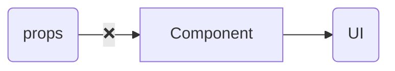
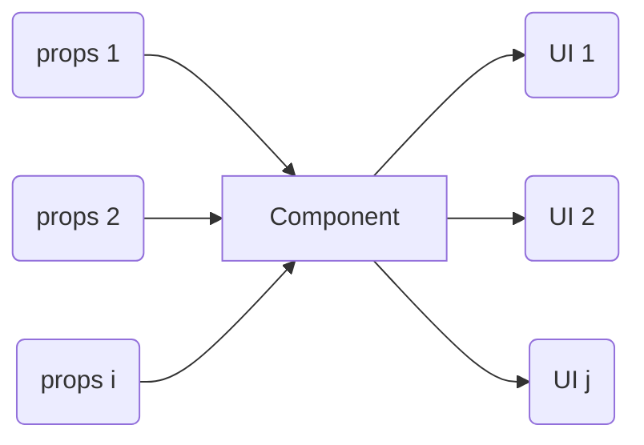

今回は React などのコンポーネントに props を追加する、つまり入力を与えることが一体どういうことなのかについて考えていく。

前に書いた「結局定義と評価が大事なのではないだろうか」という内容と少し被るので併せて見ていただきたい：
https://syakoo-lab.com/writings/20230709

## コンポーネントに props がない場合



外側から入力する props がない場合、コンポーネントは**その内部での振る舞いをそのコンポーネント定義部で全て決定する。**
そのため、基本的にはそのコンポーネントを使う場合は同じ振る舞いを得ることになり、逆に言うと使う側からはその振る舞いを変えることはできない。

### 例

#### コンポーネントの定義部

```tsx
const SyakooLabTitle = () => {
  return <h1 className="title">Syakoo Lab</h1>;
};
```

#### 使う側（評価部）

```tsx
<SyakooLabTitle />
```

## コンポーネントに props を追加する



props を追加した場合、コンポーネントは**その内部での振る舞いの一部を使う側（評価部）に決定を譲渡する。**
そのため、そのコンポーネントを定義した時点では複数の振る舞いを同時に保持することになり、使用するタイミングで具体化される。


この時に注意が必要なのが、コンポーネントが使う側の知識を暗黙的に用いると結合度が途端に増してしまうことである。
よくある例としてコンポーネントで margin や width を固定することがあげられるが、それが実際にそのコンポーネントの意図であれば問題ないが
使う側の都合でそうなっていないか考える必要がある。

### 例

#### コンポーネントの定義部

```tsx
const SyakooLabTitle = (props: { color: string }) => {
  const className = resolveClassName(props.color);

  return <h1 className={className}>Syakoo Lab</h1>;
};
```

#### 使う側（評価部）

```tsx
<SyakooLabTitle color="steelblue" />
<SyakooLabTitle color="white" />
```

## おわりに

コンポーネントに props を入れるとどうなるかについて説明した。

私の思想強めな意見として、「ReactNode を props として持つようなコンポーネントをできるだけ定義するな」というものがありそれも今回の話と関係するが、
少し長くなりそうなので今後余裕ができたら書くことにする。(UI やレイアウトコンポーネントなどのプロジェクト内で抽象化されたものは例外)
