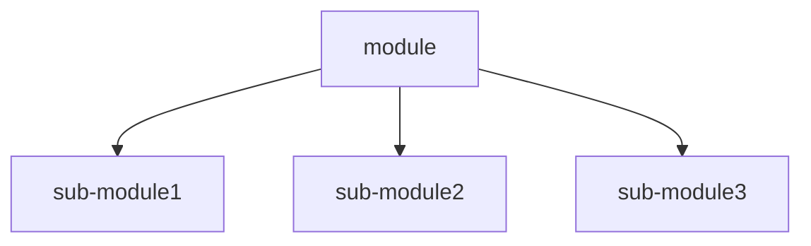

単体テストと結合テストの区別はなんとなく理解していたが、最近違いについて聞かれて曖昧な返答しかできなかったためこれを機に文章化してみる。

あくまで私の認識ですのでご了承ください。

## 単体テストと結合テストの違い

まず最初に検索してみる。色々みてみたが Wikipedia では次のように書かれている：

### 単体テスト

> コンピュータプログラミングにおいて単体テスト（たんたいテスト）あるいはユニットテスト（英語: unit test） とは、ソースコードの個々のユニット、すなわち、１つ以上のコンピュータプログラムモジュールが仕様に適しているかどうかを決定するために、関連する制御データ、使用手順操作手順とともにテストする手法である。
>
> [単体テスト - フリー百科事典『ウィキペディア（Wikipedia）』](https://ja.wikipedia.org/wiki/%E5%8D%98%E4%BD%93%E3%83%86%E3%82%B9%E3%83%88), 2023/11/15

### 結合テスト

> 統合テスト (英: integration testing)は、個々のソフトウェアモジュールを組み合わせて集合体としてテストするソフトウェアテストのフェーズである。
>
> [結合テスト - フリー百科事典『ウィキペディア（Wikipedia）』](https://ja.wikipedia.org/wiki/%E7%B5%B1%E5%90%88%E3%83%86%E3%82%B9%E3%83%88), 2023/8/27

はい。
自分もまさにこの認識ではいるが、おそらくこれらの定義をみて困るポイントは **「...ほぼ全部何かしらのモジュールに依存しているし結合テストでは？」** ではないだろうか。

### 私の区別

上記を踏まえて私の現在の単体テストと結合テストの区別する上での判断点は、 **「そのモジュールの機能の関心がそのモジュールと依存モジュールのどちらにあるか」** だと考えている。
つまり、そのモジュールがいくつかのモジュールに依存していても機能の関心がそのメインのモジュールにほとんどあれば単体となる。

関心がいくつかの依存モジュールにあるケースを考えてみる。
このモジュールの依存関係は次のように構成されるとする:

関心が依存モジュールにある場合は、module の責務を果たすためには sub-module1, sub-module2, sub-module3 が module の想定通りの挙動をする必要がある。
逆にいうと、sub-module1 が単体として問題ない挙動をしていても module にとって想定外の挙動になればそれをキャッチしてほしい。それが結合テストに当たると考えている。

## おわりに

単体テストと結合テストの区別について文章化してみたが、最初は「やるぞ！」と意気込んでいたものの最終的には「🤔」となってしまった。
ひとつ思ったのは、単体テストか結合テストか判断しにくい場合はもしかすると設計に問題があるのかもなと書きながら思った。
