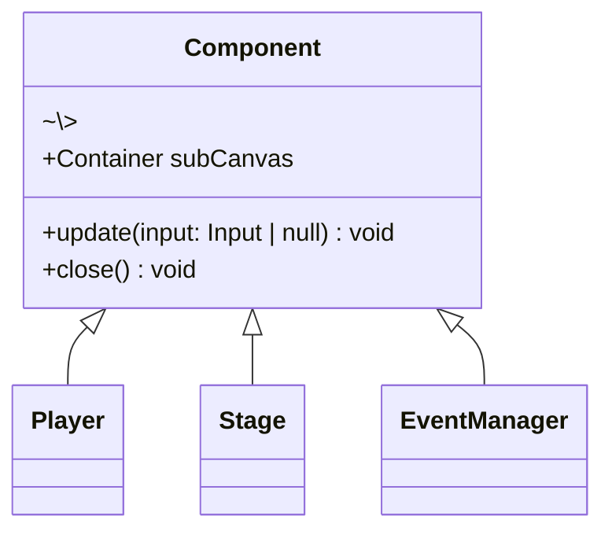

このサイトでは一度も報告したことがなかったが、最近個人でゲームを作っている。
色々あってゲームでは TypeScript と PixiJS を使い、自分なりに試行錯誤しながら慣れないクラスを定義したりしている。

1 つのゲームをなんとか作り終わり、同じ構成で 2 つ目のゲームに取り掛かっているが、実装する上で動作確認がかなりしづらく感じていた。
変更を入れるたびに毎回毎回ブラウザを再読み込みをしゲームのタイトル画面からスタートして、動作を確認したい場面まで自分で操作していたのだ。

...めんどくさい。Web 開発のように Storybook を使用してパーツごと、場面ごとに動作確認ができるようなコンポーネント駆動にしたい。

...ということで、今記事は頑張ってコンポーネント駆動に持っていくことを試みた、いわば奮闘記のようなものである。

## コンポーネント駆動

https://www.componentdriven.org/

まず、コンポーネント駆動について振り返る。

> Components are standardized, interchangeable building blocks of UIs. They encapsulate the appearance and function of UI pieces.

コンポーネントは UI と機能をカプセル化をして、標準化された交換可能な構成要素のことである。
これにより、コンポーネントは部品ながら一つ一つがある程度独立しており、挙動を確認しやすくなる。

## PixiJS

https://pixijs.com/

次に、PixiJS についてもざっくり紹介する。PixiJS は Web ブラウザ上で動作する 2D グラフィックスライブラリである。
使い方はざっくり説明すると、

- PixiJS の `Application` クラスの `stage` にキャラクター画像を渡して描画し
- `ticker.add` メソッドにキャラクターの更新する関数を渡すと、キャラクターが動く

というイメージ。具体的には以下のようなコードになる：

```ts
const app = new Application(...);

const character = new Sprite(...);

app.stage.addChild(character);
app.ticker.add(() => {
  character.x += 1;
});
```

## コンポーネント駆動で開発

さて、やっと本題のコンポーネント駆動に入る。
コンポーネント駆動で開発するためには、ゲームの部分的な UI とロジックを**コンポーネントとして同一視できるようにする必要がある**。
つまり、コンポーネントで抽象化する。



`Component` は、UI を `subCanvas` に描画し、`update` メソッドで入力に応じて状態を更新する。
そして、`close` メソッドでコンポーネントを閉じる。

このようにすることで、あとは Storybook とこの Component を繋ぎ合わせるように実装すれば、次のようにゲームの動作確認ができるようになる。

<Image
  src={"/img/writings/20240922/storybook-and-game.png"}
  caption="Storybook と Component を繋ぎ合わせる"
  style={{ width: 500 }}
/>

### 嬉しかった点1: 動作確認がしやすい

まだ実装途中ではあるが、嬉しい点が多く見つかった。
まず一つ目として、当初の課題であった動作確認が格段としやすくなった。

実装のみではなく、設計がイマイチでリファクタリングをかけるときも、動作の確認をコンポーネントレベルで行うことができ安心感があった。

### 嬉しかった点2: 責務がスッキリした

コンポーネントレベルで動作を検証するため、本来そのコンポーネントに必要のない実装や依存がなくなり、責務がスッキリした。

### 嬉しかった点3: コンポーネントでの拡張ができる

これが一番の嬉しい誤算だったのだが、コンポーネント化することによってコンポーネントの拡張が容易にでき、動作確認等がかなりしやすくなった。

この例として、実際のゲームでは使用することはないが、そのコンポーネントの全体像が見たかった時に次のコンポーネントを定義するだけで解決した：

```tsx
export class ScrollableContainer implements Component {
  public readonly subCanvas = new Container();

  constructor(private readonly child: Component) {
    this.subCanvas.addChild(child.subCanvas);
  }

  public update(input: Input | null): void {
    // 親のコンテナを上下左右に移動できるようにする
    const dv = getScrollDelta(input);
    this.subCanvas.x += dv[0];
    this.subCanvas.y += dv[1];

    this.child.update(null);
  }

  public close(): void {
    this.child.close();
  }
}
```

こうすることで、いわゆる Storybook の decorator のように、コンポーネントを包むことで新しいコンポーネントを作ることができる。

## まとめ

コンポーネント駆動で開発することで、想像以上に嬉しいことがあり、幸せになった。
まだ開発途中ではあるのだが、困った点は今のところない。設計大変だなぁと感じるくらい。

コンポーネント駆動がしにくいと感じたら、ぜひコンポーネントに抽象化をしてみてほしい。
