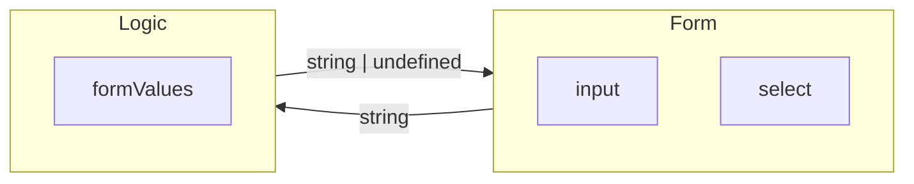

みなさんは、React x TypeScript でフォームを実装するとき、どのように実装していますか？

フォームについてよくよく考えてみると、フォームのそれぞれのフィールドとロジックで持つ値はデータ形式 (いわゆる型) が異なります。

```mermaid
flowchart LR
  subgraph Form
    input
    select
  end
  subgraph Logic
    formValues
  end
  Logic --" string | undefined "--> Form
  Form --" string "--> Logic
```

## Not Good: ロジックを Form に寄せる

## Good: Form をロジックに寄せる

本文
