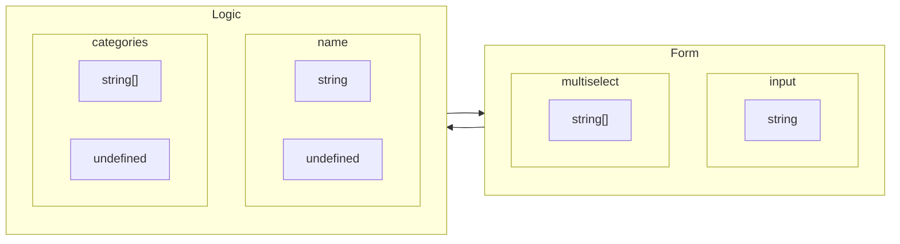

みなさんは、React x TypeScript でフォームを実装するとき、どのように実装していますか？

フォームについてよくよく考えてみると、フォームのそれぞれのフィールドとロジックで持つ値はデータ形式 (いわゆる型) が異なります。



Logic では各フィールドの値を `string` や `string[]` で、値がない場合は `undefined` として表現します。
それに対して、`<input />` や UI ライブラリによくある `<MultiSelect />` コンポーネントは `string` や `string[]` で、値がない場合は空の `""` や `[]` として表現します。

この表現の違いをどちらに寄せていくかで、実装の自然さが変わってきます。

## Not Good: ロジックを Form に寄せる

ロジックの方が自由度があるために、ロジックを Form に寄せることがよくあるかと思います。
しかしそうすると、型の表現に限界が来てしまい、不自然な実装になってしまったり必須と任意の区別がつけられなくなります。

### 例: 型の表現の限界

<Chat image="fuyu1">
  <Chat.Message>zod で吸収するように実装します</Chat.Message>
</Chat>

```ts
const formSchema = z.object({
  title: z.string(),
  comment: z.string(),
  tags: z.array(z.string()),
  categories: z.array(z.string()),
});
```

<Chat image="haru3" right>
  <Chat.Message>title と tags は必須項目にしてねー</Chat.Message>
</Chat>

<Chat image="fuyu1">
  <Chat.Message>はい</Chat.Message>
  <Chat.Message>
    ... string は文字数をチェック、string[]
    は配列数をチェックすれば良さそうですね
  </Chat.Message>
</Chat>

```ts
const formSchema = z.object({
  title: z.string().min(1), // 必須チェック
  comment: z.string(),
  tags: z.array(z.string()).min(1), // 必須チェック
  categories: z.array(z.string()),
});
```

<Chat image="fuyu2">
  <Chat.Message>フォームの型を取ってきましょうか</Chat.Message>
  <Chat.Message>...</Chat.Message>
  <Chat.Message>必須と任意がどれがどれだかわからない...</Chat.Message>
</Chat>

```ts
// type FormValues = z.infer<typeof formSchema>;
type FormValues = {
  title: string;
  comment: string;
  tags: string[];
  categories: string[];
};
```

<Chat image="haru3" right>
  <Chat.Message>あ、</Chat.Message>
  <Chat.Message>追加で number のフィールドを任意項目でよろしくー</Chat.Message>
</Chat>

<Chat image="fuyu4">
  <Chat.Message>...</Chat.Message>
</Chat>

## Good: Form をロジックに寄せる

Form をロジックに寄せ、Form と Logic 間の変換を挟むことによって、型の表現の限界を解消し、不自然な実装を避けることができます。
つまり、Logic における値なしの表現を Form の空文字列のままにするのではなく、`undefined` にする処理を挟みます。(Logic の `undefined` を Form の空文字列に変換する処理も必要)

### 例: 型の表現の限界を解消

<Chat image="fuyu1">
  <Chat.Message>
    zod の preprocess を使って、フォームの値をロジックに渡す前に変換します
  </Chat.Message>
</Chat>

```ts
const formSchema = z.object({
  title: z.string(),
  comment: z.string(),
  tags: z.array(z.string()),
  categories: z.array(z.string()),
});

const emptyToUndefined = (values) => {
  // 各フィールドの空文字や空配列を undefined に変換する
};
const formResolver = z.preprocess(emptyToUndefined, formSchema);
```

<Chat image="haru3" right>
  <Chat.Message>title と tags は必須項目にしてねー</Chat.Message>
</Chat>

<Chat image="fuyu1">
  <Chat.Message>はい</Chat.Message>
  <Chat.Message>
    ... どちらも `z.string()` と `z.array(z.string())`
    で必須チェックはできています
  </Chat.Message>
  <Chat.Message>
    comment と categories を undefined を許容するようにします
  </Chat.Message>
</Chat>

```ts
const formSchema = z.object({
  title: z.string(),
  comment: z.string().optional(), // 任意チェック
  tags: z.array(z.string()),
  categories: z.array(z.string()).optional(), // 任意チェック
});
```

<Chat image="fuyu2">
  <Chat.Message>フォームの型を取ってきます...</Chat.Message>
</Chat>

```ts
// type FormValues = z.infer<typeof formSchema>;
type FormValues = {
  title: string;
  comment?: string | undefined;
  tags: string[];
  categories?: string[] | undefined;
};
```

<Chat image="fuyu3">
  <Chat.Message>必須項目と任意項目がはっきり分かりますね</Chat.Message>
</Chat>

## まとめ

フォーム値をロジックに寄せることによって、型の表現の限界を解消し、不自然な実装を避けることができます。

...はじめてチャット形式のまとめ方をしてみましたが、思ったより冗長になりますね。使い所が難しいなぁと思いました。

## 参考

より詳細の説明として以下の記事が参考になりました。

https://zenn.dev/monicle/articles/4868424f22d6f5
