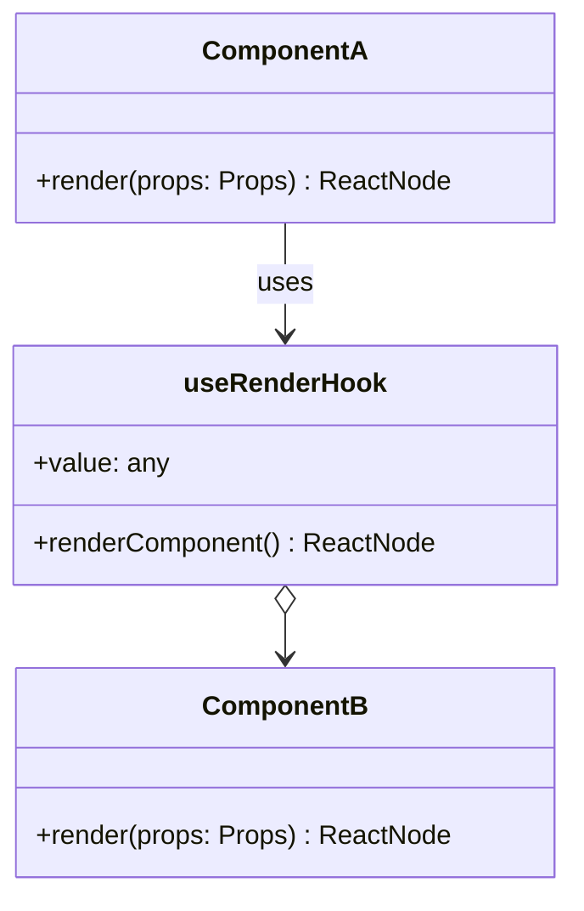

render hooks は単なる Component と異なり自由度が高くなるために、その実装は人によって結構異なります。
hook 側/Component 側どちらでロジックをもつのか、どこまで実装をもつのか、人によって分かれてしまっては結果的にコードの可読性があがってしまいます。

それをなるべく避けるため、render hooks パターンを Adapter として捉えることで、ロジックをもつ場所を明確にすることができることを説明していきます。

## render hooks パターンとは？

https://engineering.linecorp.com/ja/blog/line-securities-frontend-3

上記サイトを確認してください。
render hooks パターンを知っている上でこの記事を読む人が多いと思うので、説明は省略します。

## render hooks パターンによって自由度が高くなる

render hooks パターンはなぜ Component と異なり自由度が高くなるのでしょうか？

それは、Component は Props を受け取り ReactNode などの UI 情報を返すだけであるのに対し、render hooks は Props を受け取り UI 情報を含む一般的な値を返すためです。

```ts
type Component = (props: Props) => ReactNode;
type useRenderHook = (props: Props) => any; // ReactNode | number | string | ...
```

そのため、render hooks 内部でコンポーネントにのみ必要な情報でさえ扱うようになり、結果としてコンポーネントの責務が薄くなっていきます。

```tsx
const Component = (props: Props) => {
  // WARN: 流れてきた props を使用するだけになってしまっている (= Shallow Component)
  return (
    <div>
      <div>{props.isLoading ? "loading..." : props.value}</div>
      <button onClick={props.onClick}>load something</button>
    </div>
  );
};

const useRenderHook = (props: Props) => {
  // WARN: Component にのみ使用している情報をここで扱っている
  const [isLoading, setIsLoading] = useState(false);
  const [value, setValue] = useState(null);
  const handleClick = async () => {
    setIsLoading(true);
    setValue(await fetchSomething());
    setIsLoading(false);
  };

  const renderComponent = () => {
    return (
      <Component isLoading={isLoading} value={value} onClick={handleClick} />
    );
  };

  // NOTE: 外で欲しい情報は `value` だけ
  return { renderComponent, value };
};
```

## render hooks パターンを Adapter として捉える

まず、見比べやすいよう、私の考えるより良い実装を先に紹介します。

```tsx
const Component = (props: Props) => {
  // GOOD: 押下時のロジックを Component 内に閉じ込めることができている
  const [isLoading, setIsLoading] = useState(false);
  const handleClick = async () => {
    setIsLoading(true);
    props.setValue(await fetchSomething());
    setIsLoading(false);
  };

  return (
    <div>
      <div>{isLoading ? "loading..." : props.value}</div>
      <button onClick={handleClick}>load something</button>
    </div>
  );
};

const useRenderHook = (props: Props) => {
  // GOOD: 外で欲しい情報をここで扱う
  const [value, setValue] = useState(null);

  const renderComponent = () => {
    return <Component value={value} setValue={setValue} />;
  };

  // NOTE: 外で欲しい情報は `value` だけ
  return { renderComponent, value };
};
```

使用側のコンポーネントに必要な情報のみ、render hooks 内で定義し、それ以外のコンポーネント内でのみ必要な情報はコンポーネント内で定義します。

このようにすることによって、コンポーネントは凝集性が高くなり、そのコンポーネントを使用する側が render hooks を "Adapter" の役割として使用することになります。
つまり、下図を用いて説明すると、**useRenderHook は ComponentA が ComponentB を使用する際に、不必要な情報を自身から隠蔽するための Adapter** として使用するのがより良いということです。

この ComponentA にあたるコンポーネントが複数存在する場合は、それぞれのコンポーネントに必要な情報を考慮した上で、複数の useRenderHook が生まれたりします。



## おわりに

私が render hooks を使用する時の考え方をまとめてみました。
render hooks の使用を前提として、情報をフックにまとめるのも状況によってはあるとは思いますが、コンポーネントとフック両方に情報が無造作に生まれてしまうのは避けたいところです。
