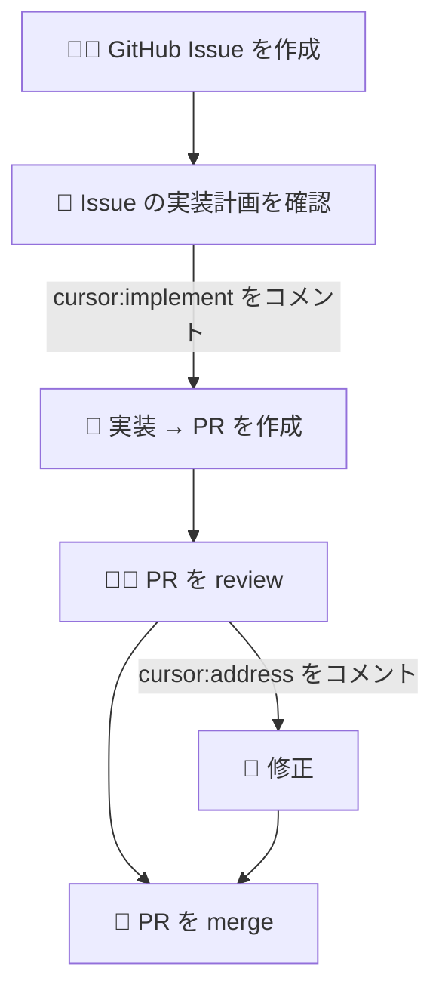

以前 Figma を仕様書として AI と一緒にサイトを作っているという話をしました。

https://syakoo-lab.com/writings/20250608

今回、ついにこのサイトのメンテナンスを AI にほぼ丸投げするようにしました。

## どうやってるか

できるだけ人間の介入を減らすことを目指し、以下のようなワークフローになっています：

説明のためにシンプルなフローを示してます。
要は人間がすることは、

- Issue を AI と一緒に作成
- Issue の実装計画を確認して問題なければ `cursor:implement` をコメント
- PR を review して問題あればコメントして `cursor:address` をコメントして修正、問題なければ merge

となりました。私が作った感がなくなって少し寂しいですね。

## 試しにやってみた

というわけで一例を挙げてみます。

まず、AI と力を合わせて Issue を作成します。
今回は Writing 一覧ページに、年ごとにグルーピングする UI を追加することにしました。

https://github.com/syakoo/syakoo-lab/issues/286

そして実装許可コメントをして待つこと約 5 分、出来上がったのがこちら：

https://github.com/syakoo/syakoo-lab/pull/287

今回は先に人間が PR をレビューしました。
PR にブランチプレビューのサイトと Storybook のリンクが出るので、基本的にはローカルで起動する必要はありません。(今回は UI の微調整のために使いましたが)

追加で別の Cursor Automation がレビューするのでそれをみて問題なさそうであればマージします。

## おわりに

ということで、前回は人間が仕様とかを考え AI と協力して開発していましたが、ついに AI にほぼ丸投げするようになりました。

...いつか全て任せそうだなぁ。

...ちなみに、この記事はフル手書きです。
