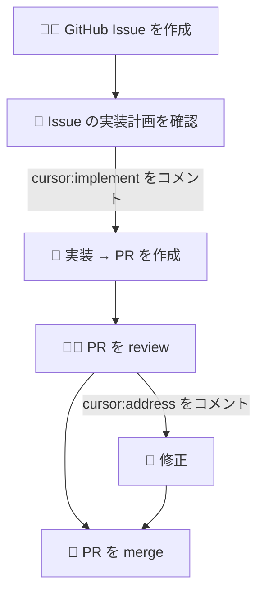

以前 Figma を仕様書として AI と一緒にサイトを作っているという話をしました。

https://syakoo-lab.com/writings/20250608

今回、ついにこのサイトのほぼ全てを AI に任せるようにしました。

## どうやってるか

できるだけ人間の介入を減らすことを目指し、以下のようなワークフローになっています：

説明のためにシンプルなフローを示してます。
要は人間がすることは、

- Issue を AI と一緒に作成
- Issue の実装計画を確認して問題なければ `cursor:implement` をコメント
- PR を review して問題あればコメントして `cursor:address` をコメントして修正、問題なければ merge

となりました。私が作った感がなくなって少し寂しいですね。

## 試しにやってみた
